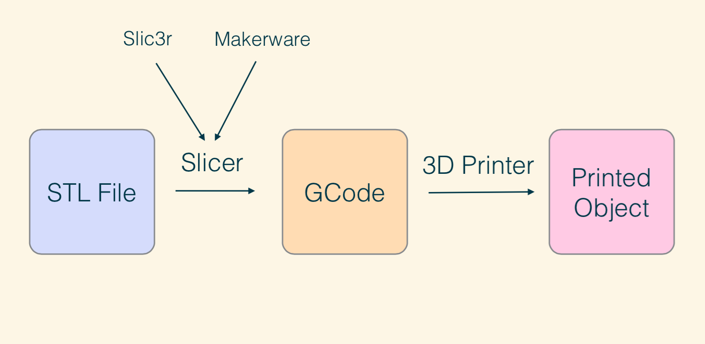
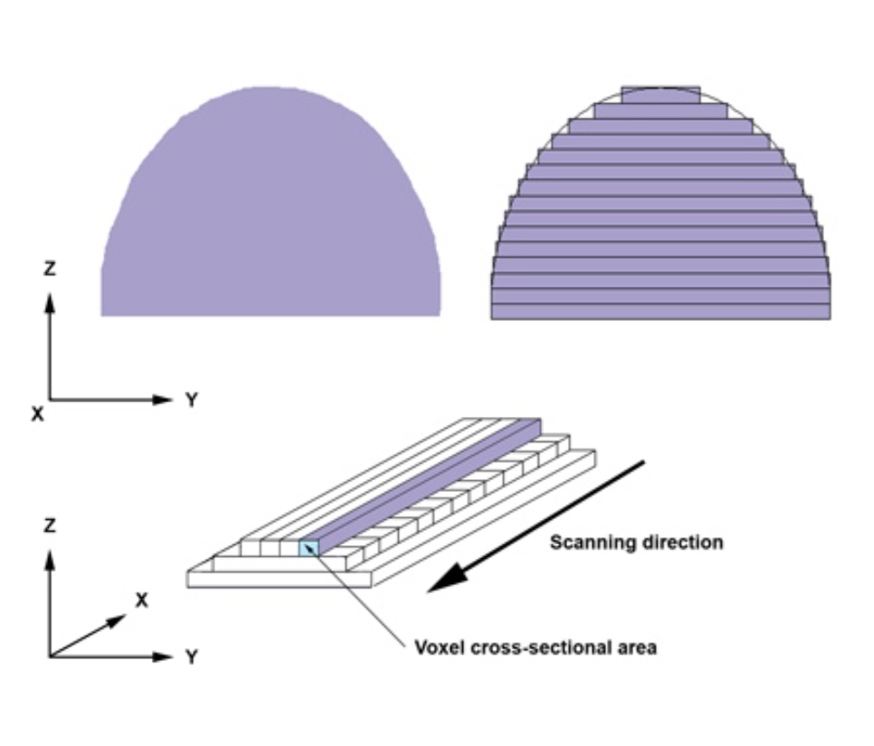

footer: @skalnik / @noopkat / RobotsConf 2014
slidenumbers: true

# 3D printing robot armies
## don't be scared

---

# Before ~2009 3D printers

. Were extremely expensive

. Required pricey materials

. Thus out of the hands of consumers

. They were, however, very accurate

---

# A Brief History

. 1989 - S. Scott Crump patents FDM

. 2007 - RepRap Darwin released

. 2009 - FDM Patent expires

. 2009 - MakerBot releases Cupcake CNC

. 2012 - > 50 consumer level 3D printers

---

# What's currently out there?

. Printrbot Simple (metal version) - $600

. Lulbot TAZ4 (seen at this conf) - $2200

---

# How do they operate?

---

---

# What is a slicer?

---

# How does slicing work?

---

# Slicing characteristics

. Layer Height - thickness of each plastic layer 

. Infill %: How solid the object will be

. Shells: The outside layer of plastic 

. Retraction: Distance to pull plastic back

---

---

# G-code

---

# Wat?

---

# A small sample

. G0 X12 ; rapid Move to X = 12

. M106 S127 ; turn fan on 50% speed

. M106 S0 ; turn fan off

. G28Y ; Move y-axis to home position

. M27 ; report status of SD card print

---

# How do I make models to print?

---

# Search Thingiverse.com

---

# Search Thingiverse.com

. Requires no modeling skills!

. Lots of robot parts available

---

# Use a 3D modeling package

---

# Tinkercad.com

. Free!

. OSX, Windows Linux

. Very ideal for 3D modeling beginners

. Created specifically for 3D printing 

. Hooks into 3D printing API's

---

# OpenSCAD

. Free!

. OSX, Windows Linux

. It's not a traditional 3D modeler 

. Designed more for programmer types 

. Parametric

---

# We will print your stuff!

# print.robotsconf.com

---

# Come and see us!

## Mike Skalnik @skalnik

## Suz Hinton @noopkat

